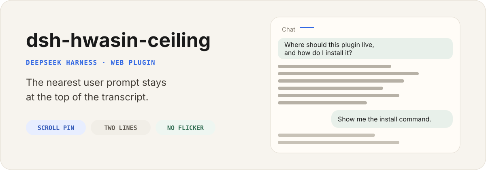

<p align="center">
  
</p>

<p align="center">
  English | <a href="./README.zh.md">中文</a>
</p>

<p align="center">
  <a href="https://github.com/zhuyu1985-web/dsh-hwasin-ceiling/actions"></a>
  <a href="./LICENSE"></a>
  
</p>

`dsh-hwasin-ceiling` is a standalone Web plugin for DeepSeek Harness. While you scroll a long reply, the nearest user prompt stays at the top of the conversation as a compact full-width bar.

Original bubbles keep their layout. The plugin does not edit messages, fork sessions, or restore workspace files.

## Install

```sh
npx @deepseek-ai/dsh plugin --profile web add dsh-hwasin-ceiling
```

The bare name installs the npm release. To install straight from GitHub instead:

```sh
npx @deepseek-ai/dsh plugin --profile web add github:zhuyu1985-web/dsh-hwasin-ceiling
```

Restart Harness, then hard-refresh the browser. After at least one user message exists, scroll the transcript: when a prompt leaves the top of the scrollport, the bar appears.

To lock a reproducible install, append a commit SHA:

```sh
npx @deepseek-ai/dsh plugin --profile web add github:zhuyu1985-web/dsh-hwasin-ceiling#10b8cde
```

## What it does

- Pins the last user prompt that has crossed the top of `[data-conversation-scroll]`.
- Uses one overlay bar, so two topics cannot fight and flicker.
- Flattens original line breaks to spaces before the two-line clamp.
- Morphs from the source bubble into the bar on the way up; fades out on the way down.
- Jumps back to the original bubble when the bar is clicked.

## What it does not do

- It does not replace `UserStyleBubble` or the session header.
- It does not edit, rewind, or fork the session log.
- It does not persist settings. There is no Settings card and no Host storage.

## Update and remove

```sh
npx @deepseek-ai/dsh plugin --profile web remove dsh-hwasin-ceiling
npx @deepseek-ai/dsh plugin --profile web add dsh-hwasin-ceiling
```

Restart Harness after either command.

## Compatibility

This release targets DeepSeek Harness `0.1.0-rc.6`. DeepSeek Harness is still in Developer Preview.

`WARN Issues with peer dependencies found` during install is expected when the profile root does not declare Harness Client peers. It is not a load failure.

## Development

```sh
pnpm install
pnpm test
pnpm typecheck
pnpm build
```

For a local profile:

```sh
npx @deepseek-ai/dsh plugin --profile web add file:$PWD
```

Rebuild `lib/` after source changes. The published GitHub tree includes `lib/index.js` and `lib/client.js`, so install does not need `allowBuilds`.

## License

[MIT](LICENSE)

---

This is an independent community project and is not affiliated with or endorsed by DeepSeek.
