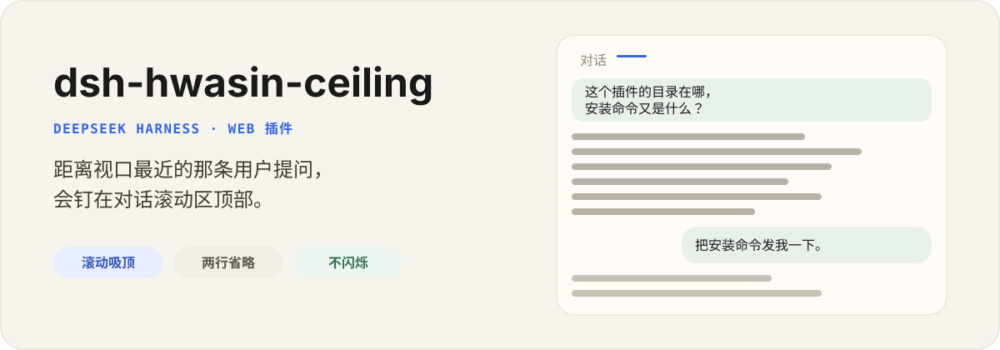

<p align="center">
  
</p>

<p align="center">
  <a href="./README.md">English</a> | 中文
</p>

<p align="center">
  <a href="https://github.com/hwasin/dsh-hwasin-ceiling/actions"></a>
  <a href="./LICENSE"></a>
  
</p>

`dsh-hwasin-ceiling` 是 DeepSeek Harness 的独立 Web 插件。长回复往上滚时，距离当前滚动窗口最近的那条用户提问，会收成通栏摘要钉在对话顶部。

原文气泡保持原来的布局。插件不编辑消息、不分叉会话，也不恢复工作区文件。

## 安装

```sh
npx @deepseek-ai/dsh plugin --profile web add github:hwasin/dsh-hwasin-ceiling
```

重启 Harness，然后硬刷新浏览器。对话里至少有一条用户消息后，往上滚动：提问离开滚动区顶部时，摘要条会出现。

需要可复现安装时，在仓库地址后加上提交 SHA：

```sh
npx @deepseek-ai/dsh plugin --profile web add github:hwasin/dsh-hwasin-ceiling#fa3241a
```

## 会做什么

- 钉住已经越过 `[data-conversation-scroll]` 顶部的最后一条用户提问。
- 只用一条覆盖层，两条话题不会互相抢位置、来回闪。
- 吸顶前把原文换行收成空格，再做两行省略。
- 上去时从原气泡滑到通栏；下来时淡出，不再拉伸文字。
- 点击摘要条会回到原来的气泡。

## 不会做什么

- 不替换 `UserStyleBubble`，也不替换会话标题栏。
- 不编辑、撤回或分叉会话日志。
- 不保存设置。没有设置卡，也没有 Host 存储。

## 更新和卸载

```sh
npx @deepseek-ai/dsh plugin --profile web remove dsh-hwasin-ceiling
npx @deepseek-ai/dsh plugin --profile web add github:hwasin/dsh-hwasin-ceiling
```

两条命令之后都要重启 Harness。

## 兼容

这一版对应 DeepSeek Harness `0.1.0-rc.6`。Harness 仍处于 Developer Preview。

安装时如果看到 `WARN Issues with peer dependencies found`，通常是 profile 根包没有声明 Harness Client 的 peer，不等于加载失败。

## 开发

```sh
pnpm install
pnpm test
pnpm typecheck
pnpm build
```

本地 profile：

```sh
npx @deepseek-ai/dsh plugin --profile web add file:$PWD
```

改源码后重新构建 `lib/`。GitHub 仓库里已经包含 `lib/index.js` 和 `lib/client.js`，安装时不需要 `allowBuilds`。

## 许可

[MIT](LICENSE)

---

这是独立的社区项目，与 DeepSeek 没有从属或背书关系。
